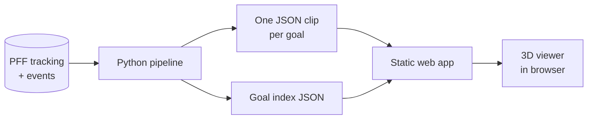

# Goal Replay: 3D World Cup Goal Viewer (Project Brief)

Sep 23, 2026 · @zayd

## Overview

Goal Replay is a web app where you pick any player from the 2022 World Cup, pick one of their goals, and watch a 20-second 3D replay of it built from real tracking data. You can pause, scrub, slow it down, and move the camera around the pitch, similar to a FIFA replay.

Why build it: it's fun to work on, it looks impressive in a 10-second GIF, and it shows real engineering (data pipeline, coordinate transforms, animation, 3D rendering). It also connects the soccer background to technical work on the personal site.

"Goal Replay" is a working name.

## Goals and non-goals

Goals:

- Every goal from the 2022 World Cup replayable in 3D from a public link
- Smooth playback with pause, scrub, and speed controls
- A camera you can orbit and zoom, plus a few preset views
- No backend: a static site that can sit inside the personal site

Non-goals (for v1):

- Animated human models (players are simple shapes with numbers)
- Full 90-minute playback; only the 20 seconds around each goal
- LLM features, stats dashboards, or other tournaments
- Accounts, comments, or any server

## Data

Use PFF FC's free [2022 World Cup dataset](https://www.gradientsports.com/blog/enhanced-2022-world-cup-dataset) (PFF FC now publishes as Gradient Sports). It combines broadcast tracking with event data for all 64 matches, and access is through a sign-up form.

- **Tracking:** one file per match with the position of every player and the ball over time. This is what drives the replay.
- **Events:** tells you when each goal happened and who scored. This is how you find the 20-second window to cut.
- **Metadata and rosters:** player names, jersey numbers, and teams for labels.
- **Loader:** the kloppy Python library reads PFF tracking directly.

Check once you have the files:

- [ ] Usage terms: confirm a public portfolio app is allowed and how to credit the source
- [ ] Frame rate and whether the ball has a height value (needed for crosses and chips in the air)
- [ ] How often players drop out of frames when they're off-camera
- [ ] Total goal count (roughly 170, from memory)

## Features

The MVP is a player picker, a goal list, and the 3D viewer with playback and camera controls.

| Feature | What it does |
| --- | --- |
| Player search | Type a name, see every player who scored |
| Goal list | Each goal with opponent, minute, and match score |
| 3D pitch | Pitch with lines and goals; players as simple shapes in team colors with jersey numbers |
| Ball | Moves with the tracking data; in the air if height data exists |
| Playback | Play/pause, scrub bar, 0.25x / 0.5x / 1x speed, jump to the moment of the shot |
| Camera | Free orbit and zoom, plus presets: top-down, broadcast side view, behind the goal, follow the ball |
| Labels | Hover or tap a player to see their name |

Clip length: about 15 seconds before the goal to 5 seconds after.

## Architecture

All the heavy data work happens once, offline, in Python. The app only loads small pre-cut clip files, so it needs no server.

1. **Pipeline (Python):** for each match, find goal events, cut the tracking frames for the clip window, convert coordinates to a standard pitch (e.g. 105 × 68 m, centered at 0,0), fill small gaps, and write one compact JSON file per goal.
2. **Goal index:** one small JSON file listing every goal (scorer, team, opponent, minute, clip file name). This powers the player search and goal list.
3. **Clip format:** metadata (teams, colors, players) plus an array of frames, each with a timestamp, ball x/y/z, and player x/y by player ID. Drop precision to 2 decimals to keep files small.
4. **Viewer:** loads a clip, then on every animation frame works out the current match time, finds the two nearest data frames, and interpolates positions between them so playback stays smooth at any speed.

## Tech stack

| Piece | Choice | Why |
| --- | --- | --- |
| Data pipeline | Python, kloppy, pandas | kloppy reads PFF tracking directly |
| Frontend | React + Vite, TypeScript | Standard, fast, good for your résumé |
| 3D | three.js via react-three-fiber + drei | drei gives orbit controls, text labels, and camera helpers for free |
| State | Zustand or plain React state | Playback time, speed, selected goal |
| Hosting | Vercel or GitHub Pages | Free static hosting; clip files served as static assets |
| Tests | pytest for the pipeline | Check coordinate conversion and clip cutting |

No backend, no database, no API keys.

## Build plan

Five weekends to a shipped v1, assuming 8–10 hours each around school. Start with one goal and make it great before scaling to all of them.

| Phase | Work | Done when |
| --- | --- | --- |
| Weekend 1: data | Get dataset access. Load the final (Argentina vs France) with kloppy. Find Messi's first goal, cut 20 seconds, plot a few frames in matplotlib to sanity-check positions. | Clip JSON for one goal exists and frames look right on a 2D plot |
| Weekend 2: 3D basics | React + react-three-fiber app. Pitch, players as shapes, ball. Load the one clip and animate it at 1x. | One goal plays end to end in the browser |
| Weekend 3: controls | Play/pause, scrub bar, speed, interpolation, orbit camera, camera presets, player labels. | Playback is smooth at 0.25x and scrubbing works without jumps |
| Weekend 4: scale up | Run the pipeline on all 64 matches. Build the goal index, player search, and goal list. | Any goal in the tournament loads and plays |
| Weekend 5: ship | Polish, mobile check, deploy, README, demo GIF, add to personal site. | Public link works on your phone |

## Risks

| Risk | Fallback |
| --- | --- |
| Dataset terms don't allow a public app | Keep the repo public but host the demo privately and show it via GIF and video |
| No ball height data | Ball stays on the pitch plane; add a simple arc for long passes as a later fix |
| Players missing when off-camera | Fade them out instead of freezing them; interpolate short gaps |
| Goal timestamps don't line up exactly with tracking | Check a few goals by eye; add a per-clip offset if needed |
| Jittery movement | Light smoothing in the pipeline, interpolation in the viewer |
| Scope creep into animated player models | Out of scope for v1. Shapes are the look. |
| Momentum drops mid-term | Weekend 2 already gives a shareable clip; post it early |

## Shipping

The README should open with the live link and a GIF of a goal replaying with the camera moving.

README outline:

1. One-line description + live link
2. Demo GIF
3. How it works: the pipeline diagram and a short explanation of clip cutting and interpolation
4. Challenges you solved (coordinate systems, off-camera players, timing sync). This is the part interviewers ask about.
5. How to run locally
6. Data credit

On the personal site: embed the viewer directly or link to it, with a short plain line connecting it to your soccer background.

## Stretch ideas

Only after v1 is live:

- **Player's-eye camera:** first-person view from any player's position, looking toward the ball
- **Trails:** show the path of the ball and the scorer over the clip
- **Any moment, not just goals:** big chances, saves, key passes
- **Share links:** a URL that opens a specific goal at a specific timestamp and camera angle
- **Short AI caption:** a one-line description of each goal, generated once in the pipeline (no live API needed)
